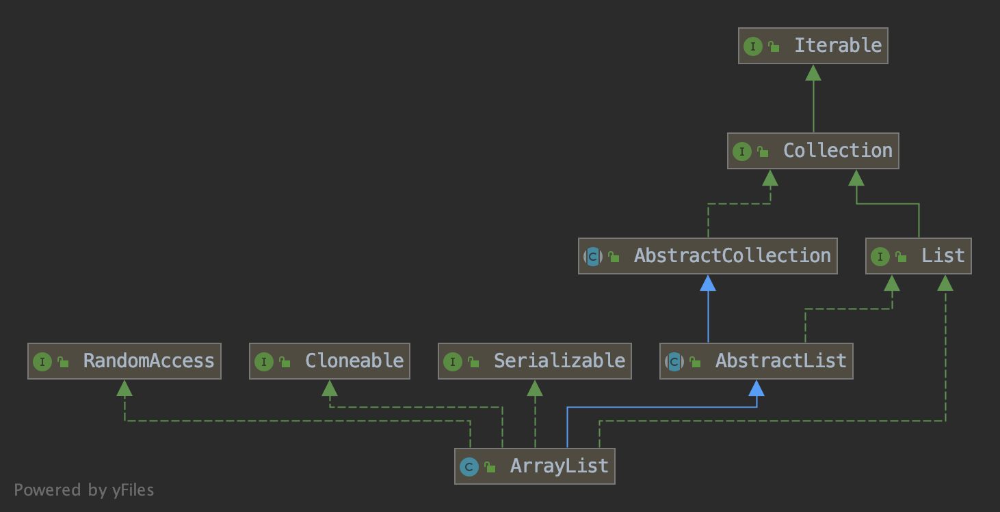
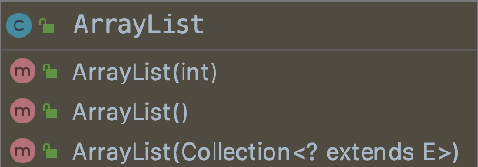

# ArrayList（jdk1.8）

### 类属性

``` java
public class ArrayList<E> extends AbstractList<E>
        implements List<E>, RandomAccess, Cloneable, java.io.Serializable{
    // 版本号
    private static final long serialVersionUID = 8683452581122892189L;
    // 缺省容量
    private static final int DEFAULT_CAPACITY = 10;
    // 空对象数组
    private static final Object[] EMPTY_ELEMENTDATA = {};
    // 缺省空对象数组
    private static final Object[] DEFAULTCAPACITY_EMPTY_ELEMENTDATA = {};
    // 元素数组
    transient Object[] elementData;
    // 实际元素大小，默认为0
    private int size;
    // 最大数组容量
    private static final int MAX_ARRAY_SIZE = Integer.MAX_VALUE - 8;
}
```

### 类继承关系图


### 构造方法



1. int参数构造方法

   ```java
       /**
        * Constructs an empty list with the specified initial capacity.
        * 构造一个具有指定初始容量的空列表。
        * @param  initialCapacity  the initial capacity of the list
        * @throws IllegalArgumentException if the specified initial capacity
        *         is negative
        */
       public ArrayList(int initialCapacity) {
           if (initialCapacity > 0) {
               this.elementData = new Object[initialCapacity];//创建指定长度initialCapacity
           } else if (initialCapacity == 0) {
               this.elementData = EMPTY_ELEMENTDATA;//创建默认长度10
           } else {
             	//否则非法数据异常
               throw new IllegalArgumentException("Illegal Capacity: "+
                                                  initialCapacity);
           }
       }
   ```

2. 无参构造方法

   ```java
   /**
   * Constructs an empty list with an initial capacity of ten.
   * 构造一个初始容量为10的空列表。
   */
   public ArrayList() {
   		this.elementData = DEFAULTCAPACITY_EMPTY_ELEMENTDATA;// 10
   }
   ```

3. 构造方法3

   ```java
       /**
        * Constructs a list containing the elements of the specified
        * collection, in the order they are returned by the collection's
        * iterator.
        * 构造一个包含指定集合的元素的列表，其顺序由集合的迭代器返回。
        * @param c the collection whose elements are to be placed into this list
        * @throws NullPointerException if the specified collection is null
        */
       public ArrayList(Collection<? extends E> c) {
           elementData = c.toArray();
           if ((size = elementData.length) != 0) {
               // defend against c.toArray (incorrectly) not returning Object[]
               // (see e.g. https://bugs.openjdk.java.net/browse/JDK-6260652)
               if (elementData.getClass() != Object[].class)
                   elementData = Arrays.copyOf(elementData, size, Object[].class);
           } else {
               // replace with empty array.
               this.elementData = EMPTY_ELEMENTDATA;
           }
       }
   ```

> 总结：ArrayList的构造方法就做一件事情，就是初始化一下储存数据的容器，其实本质上就是一个object类型数组，在其中就叫elementData。


## testAdd

添加元素时先对list进行检查
